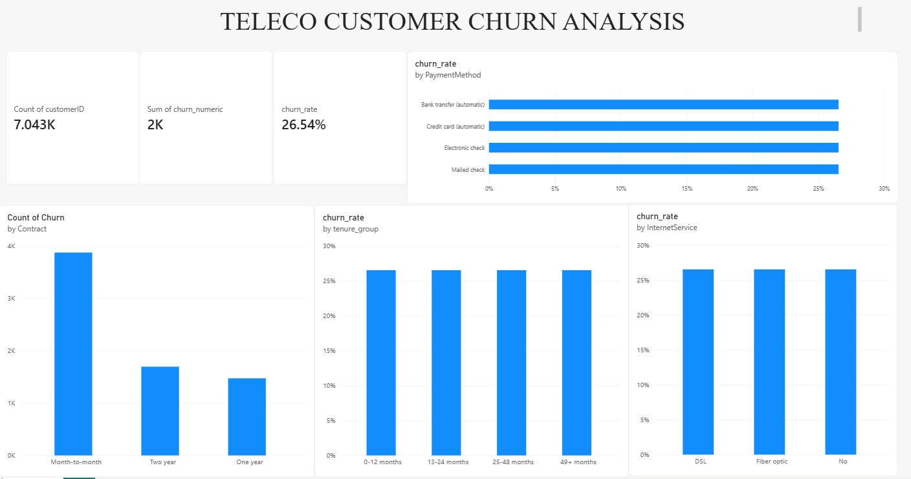

# Telco Customer Churn Analysis 
# Business Problem
~ Customer churn is an important problem for telecommunications companies because losing existing customers can affect recurring revenue and increase the effort required to acquire new customers.
~ The problem addressed in this project is to understand which customer groups are more likely to leave, what factors are associated with higher churn, and how the company can use this information to improve customer retention.
Rather than looking at all customers in the same way, the analysis focuses on identifying customer segments where churn is particularly high.

 # Research Question 
What factors are associated with customer churn, and how can economic reasoning, data analysis, and machine learning be used to understand and predict customer attrition?
 
# Objective
The main objectives of the project are to:
•	Understand the overall customer churn pattern.
•	Identify customer segments with higher churn rates.
•	Examine the relationship between churn and factors such as tenure, contract type, payment method and monthly charges.
•	Use SQL to compare churn across different customer groups.
•	Use machine learning to predict customer churn.
•	Develop a Power BI dashboard to communicate the findings.
•	Suggest possible strategies that can help improve customer retention.

# Dataset
~ The project uses the Telco Customer Churn dataset, which contains 7,043 customer records and 21 variables.
~ The dataset includes information about customer demographics, tenure, contract type, payment method, internet and additional services, monthly charges, total charges and churn status.
~ The target variable is Churn, which indicates whether a customer has left the company.

 # Methodology
The project was carried out in several stages:-
~ Data Cleaning
      Python was used to inspect and clean the dataset. This included checking the structure and data types, identifying missing or inconsistent values and preparing the variables for analysis.
      Particular attention was given to the TotalCharges variable, which was initially stored as a text field and needed to be converted into a numerical format.
~ Exploratory Data Analysis
      Exploratory analysis was performed to understand the distribution of customers and identify patterns in churn.
      The analysis focused on variables such as tenure, contract type, payment method, monthly charges, internet service, partner and dependent status, Online Security and Technical Support.
~ SQL Analysis
      SQL was used to segment customers and calculate churn rates for different groups.
      The analysis included churn by:
          •	Tenure group
          •	Contract type
          •	Payment method
          •	Monthly charge group
          •	Partner and dependent status
          •	Online Security and Technical Support
~ Machine Learning
      A Logistic Regression model was used to predict customer churn.
      The cleaned data was prepared for modelling by selecting relevant customer and service characteristics and converting categorical variables into a suitable format.
      The model was trained to estimate whether a customer was likely to churn. This added a predictive perspective to the project alongside the descriptive analysis.
~ Power BI Dashboard
      Power BI was used to create an interactive dashboard presenting the major churn patterns and customer segments identified during the analysis.

# Key Findings
~ The analysis showed that customer churn varies considerably across different customer segments.
~ The overall churn rate was 26.54%.
~ Customers in the 0–12 month tenure group had the highest churn rate at 47.44%, while customers with 49+ months of tenure had a much lower churn rate of 9.51%.
~ Month-to-month customers showed considerably higher churn compared with customers on longer-term contracts.
~ Customers using Electronic Check had the highest churn rate among the payment methods analyzed, at 45.29%.
~ Customers in the $70–$99 monthly charge group had a churn rate of 37.91%.
~ Customers without a partner had a churn rate of 32.96%, compared with 19.66% among customers with a partner.
~ Customers who had both Online Security and Technical Support had a much lower churn rate of 9.01%.

# Factors Associated with Higher Churn
Based on the analysis, several customer characteristics were associated with higher churn.
~ Shorter tenure: Customers who had recently joined the company were much more likely to churn than long-term customers.
~ Month-to-month contracts: Customers without a long-term contract showed higher churn and may have greater flexibility to switch providers.
~ Payment method: Electronic Check users showed a particularly high churn rate and represent an important segment for further investigation.
~ Monthly charges: Higher monthly charge groups showed higher churn in certain segments, suggesting that the relationship between price and perceived value may be important.
~ Additional services: Customers with Online Security and Technical Support had substantially lower churn, suggesting that these services may be associated with stronger retention.
These findings show associations rather than proving that any individual factor directly causes a customer to churn.

 # Business Recommendations
Based on the findings, the company could focus its retention efforts on customer groups with higher churn.
~ Focus on new customers
       Since churn is particularly high during the first 12 months, the company could strengthen onboarding, early engagement and customer support during this period.
~ Encourage suitable customers toward longer-term contracts
       Customers on month-to-month contracts could be offered appropriate plans or incentives that encourage longer-term relationships.
~ Review higher-charge customer segments
       Customers paying relatively higher monthly charges could be monitored to understand whether pricing, service value or customer experience is contributing to churn.
~ Investigate Electronic Check users
       The high churn rate among Electronic Check users suggests that this segment should be examined further to understand whether payment experience or other customer characteristics are involved.
~ Promote relevant additional services
       The lower churn observed among customers with Online Security and Technical Support suggests that suitable service bundles may help strengthen customer retention.

 # Machine Learning Prediction
~ The project uses Logistic Regression to predict customer churn.
~ Unlike the descriptive analysis, which looks at patterns in customers who have already churned, the model provides a way to estimate the likelihood of churn for individual customers based on their characteristics.
~ This can help the company identify potentially high-risk customers and focus retention efforts before they leave.

# Power BI Dashboard
The Power BI dashboard provides an interactive view of the customer churn analysis.
It brings together the main customer metrics, churn patterns and segment-level findings so that the results can be explored visually.
Telco Customer Churn Dashboard

# Project Files
This repository contains:
•	Cleaned CSV – cleaned customer churn dataset
•	Colab Notebook – Python analysis and machine learning work
•	Power BI Dashboard – interactive dashboard
•	Dashboard Screenshot – preview of the dashboard

 # Conclusion
The analysis shows that customer churn is concentrated in certain customer segments rather than being evenly distributed across the customer base.
Newer customers and month-to-month customers show particularly high churn, while payment method, monthly charges and additional services are also associated with differences in churn.
The main takeaway is that customer retention can be approached using customer-level data to identify higher-risk segments and understand their characteristics. Combining Python, SQL, Logistic Regression and Power BI makes it possible to move from data cleaning and analysis to prediction, visualization and targeted business recommendations.
This project demonstrates how data analysis can be used to turn a business problem into measurable findings and potential retention strategies.
